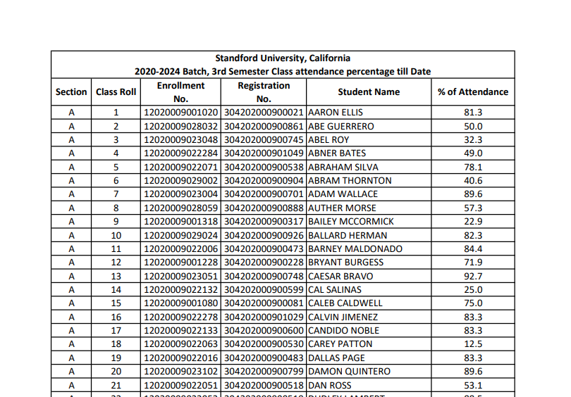

# [ATTENDANCE ANALYZER]

## Table of Contents

- [Introduction](#introduction)
- [Getting Started](#getting-started)
- [Usage](#usage)
- [Features](#features)
- [Contributing](#contributing)
- [License](#license)

## Introduction

- A few weeks back our University released an attendance record pdf like this:
  
- Everyone were manually trying to find the student having highest and lowest attendance.
- So I thought why not automate this and let python do the job for us.
- I quickly used [camelot] to convert the pdf to csv and used [pandas] to analyse the csv.
- It wasn't that smooth to convert the pdf to csv. But I somehow figured it out by some trial and errors.
- I've also added a more features than I initially planned to do and will be adding more onto it.

## Getting Started

### Requirements

- If you want to test the program on your particular PDF, then use camelot to convert your pdf to csv

```shell
$ pip install camelot
```

- Otherwise, if you just want to look how the project works, then you'd only require the pandas library

```shell
$ pip install pandas
```

### Installation

- This is a CLI project so, it doesn't need an installation. Just Download and run :)
- I've already added a dummy `PDF` file and its `csv` converted version to the repo for testing.
- If you want to use you own PDF then convert it to csv using _camelot_ and play around with it.

## Usage

```shell
$ py main.py
Welcome to Student Attendance Analyzer
```

- After this the program will check if the csv file named `student_attendance.csv` exists in data folder.
- If it doesn't exist, don't worry. It will automatically convert the pdf to csv.
- <span style="color:red"> WARNING: </span>But Make sure that the csv file has the name <i> student_attendance.csv </i>

```shell
 0. Exit
 1. View All Student Records
 2. View particular student Record with FULL NAME
 3. View Student record with maximum % of Attendance
 4. View Student record with minimum % of Attendance
 5. View Student records with % of Attendance below 50%
 6. View Student records with % of Attendance below 20%
 7. View Attendance Statistics
 8. Scatter Plot Attendance Records
 9. Plot Attendance Records Segment wise
10. Pie Chart Representation
11. Standard Deviation/Bell Curve of this Record
Enter your choice:
```

This menu will prompt you to choose from the following available features.

## Features

<details>
<summary> 1. Scatter Chart for Summary view of Records </summary>
All Records are grouped with a Coloured which signify the current situation of attendance to simplify 
viewing at a glance. <br><br>


</details>  

<details>
<summary> 2. Bar Chart Quantitative analysis of Students </summary>
You can also Quantitatively visualize how many students fall on each attendance range <br><br>


</details>  

<details>
<summary> 3. Pie Chart for Percentage wise analysis of each attendance Range </summary>
If you need get a glance of what percentage of student overall 
form a particular attendance sector then use the pie chart <br><br>


</details>  

<details>
<summary> 4. Instant view of student in having max and min attendance </summary>

<div class="language-shell highlighter-rouge"><div class="highlight"><pre class="highlight"><code>Enter your choice: 3  
<br>
Students having maximum % of Attendance:
F 34 12020009001102 304202000900103 HENERY TANNER 97.9
<br>
Enter your choice: 4  
<br>
Student(s) having minimum % of Attendance:
K 41 12020009001262 304202000900262 LUIS CHARLES 6.5
</code></pre></div></div>
</details>

<details>
<summary> 5. Sorting students having attendance below 50% and 20% </summary>
This will be helpful to quickly recognize students who are in danger and would need to 
improve their attendance quickly.<br>

<div class="language-shell highlighter-rouge"><div class="highlight"><pre class="highlight"><code>Enter your choice: 5
<br>
Students having (% of Attendance <= 50%):
A 2 12020009028032 304202000900861 ABE GUERRERO 50.0
A 3 12020009023048 304202000900745 ABEL ROY 32.3
A 4 12020009022284 304202000901049 ABNER BATES 49.0
:         :             :           :            :
:         :             :           :            : 
L 67 12020009001283 304202000900283 WONG VELEZ 39.1
L 70 12020009023112 304202000900809 WYATT HAMMOND 25.0
<br>
Enter your choice: 6
<br>
Students in danger zone (% of Attendance <= 20%):
A 18 12020009022063 304202000900530 CAREY PATTON 12.5
A 25 12020009022025 304202000900492 EARLY HOOVER 10.4
A 34 12020009022285 304202000901050 GARFIELD GONZALES 10.4
:         :             :           :            :
:         :             :           :            :
L 64 12020009001224 304202000900224 WINFIELD GRIFFIN 7.6
L 66 12020009001122 304202000900122 WM BUCHANAN 17.4
</code></pre></div></div>
</details>

<details>

<summary> 6. Quick summary of Statistics of the Records </summary>

<div class="language-shell highlighter-rouge"><div class="highlight"><pre class="highlight"><code>Enter your choice: 7
<br>
Minimum % of Attendance is 6.5 
Maximum % of Attendance is 97.9 
Mean % of Attendance is 67.03 
Median % of Attendance is 75.00 
Mode % of Attendance is 75.0 
Variance of % of Attendance is 497.43 
Standard Deviation of % of Attendance is 22.30
</code></pre></div></div>
</details>

## Contributing

Here's how we suggest you go about proposing a change to this project:

1. [Fork this project] to your account.
2. [Create a branch] for the changes that you desire to make.
3. Commit and Push your changes to your fork
4. [Send a pull request] from your fork's branch to this `master` branch

## License

- See [LICENSE]

**Pritam, 2021**


<!-- Links -->

[license]: https://github.com/warmachine028/Attendance-Analyzer/blob/main/LICENSE

[camelot]: https://camelot-py.readthedocs.io/en/master/index.html

[pandas]: https://pandas.pydata.org/

[Fork this project]: https://docs.github.com/en/get-started/quickstart/fork-a-repo

[Create a branch]: https://help.github.com/articles/creating-and-deleting-branches-within-your-repository

[Send a pull request]: https://help.github.com/articles/using-pull-requests/

[Attendance Analyzer]: https://warmachine028.github.io/Attendance-Analyzer/
